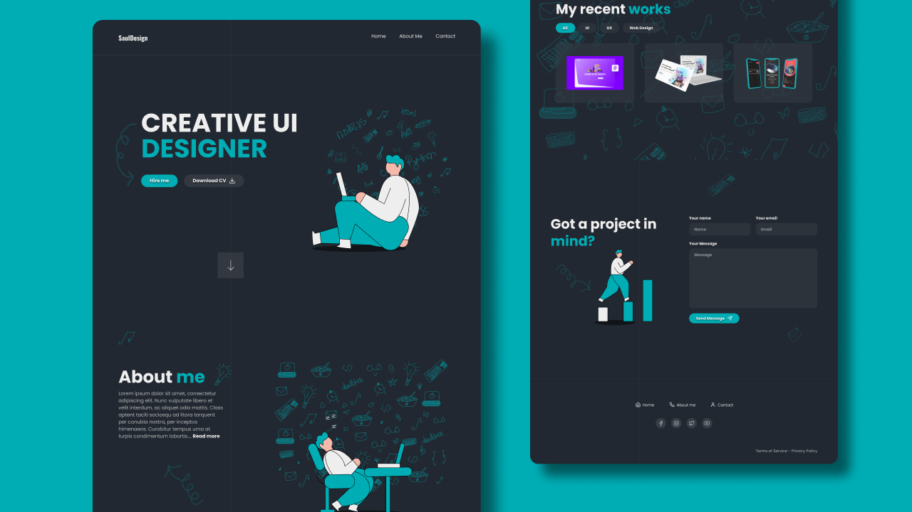

# Portfólio WebSite

O projeto consiste em um portfólio no estilo de currículo usando React com o Vite e também o micro-processador SASS.

No projeto existe apenas uma página onde tem uma apresentação sobre o portfólio com formas de contato e um botão para download do currículo.

O layout também conta com a responsividade para Desktop, Tablet e versões Mobile.

## Layout




## 🚀 Começando

Pra começar, primeiro clone o repositório do projeto pra sua máquina

```
$ git clone https://github.com/Vinicius-Rubia/Landing_Page_React.git
```

## ⚙️ Iniciando o Projeto

Para iniciar, execute os seguintes comandos em seu terminal:

```
$ cd Landing_Page_Portfolio_React -> Mudar para o diretório do projeto
```

```
$ npm install -> Instalar todas as dependências

ou então...

$ yarn -> Instalar todas as dependências
```

```
$ npm run dev -> Iniciar o projeto

ou então...

$ yarn run dev -> Iniciar o projeto
```
Creditos: Design utilizado no projeto foi criado pela comunidade do Figma

⌨️ com ❤️ por [Vinicius Rubia](https://github.com/Vinicius-Rubia) 😊